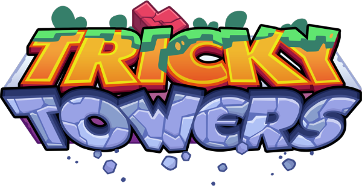

<!-- PROJECT LOGO -->
 

  

  <h3 align="center">Tricky Towers Game Replica</h3>

  

     
    <a href="https://github.com/AndreiMiron-hub/TrickyTowers_Replica"><strong>Explore the project »</strong></a>
     
  

<!-- TABLE OF CONTENTS -->

  
Table of Contents

  <ol>
    <li>
      <a href="#about-the-project">About The Project</a>
      <ul>
        <li><a href="#built-with">Built With</a></li>
      </ul>
    </li>
    <li><a href="#roadmap">Roadmap</a></li>
    <li><a href="#contact">Contact</a></li>
    <li><a href="#acknowledgments">Acknowledgments</a></li>
  </ol>

## About The Project

[![Product Name Screen Shot][product-screenshot]](https://github.com/AndreiMiron-hub/TrickyTowers_Replica)

Tricky Towers is an interesting reinterpretation of the classic Tetris game where instead of completely filling up the horizontal lines you have to build the tower as high as it can go in a certain ammount of time or endless depending on the gamemode.

This replica intends to recreate its endless mode from scratch and is nothing more than an exercise project for me to dabble into Unity development.

First steps taken in were to familiarize myself with basic menu settings and creating a basic user interface for the main settings needed.
[![Options Menu Screen Shot][optionsMenu-screenshot]](https://github.com/AndreiMiron-hub/TrickyTowers_Replica)

- As for the game loop, I decided to implement the endless game mode as it was the most straight forward part of the game.
- The pieces that will be given to you will be random and your main purpose is to build as high as you can go. Once in its place on the log the piece is not frozen. It will still be affected by gravitation which means that it can fall off later and the hight of the tower will decrease. The height of the tower represents the score you accumulated each round.
- Each block placed that still stands on the log will give you a certain amount of points. The points earned by placing pieces will be used as currency for activating the spells.
- The spells implemented in this iteration of the game will allow you to:
  1. Rotate the piece that is falling
  2. "Burn" the last piece placed on the log in the case you decide it you did not place it where you initially intended.
  3. "Tie" the blocks already placed together and the gravitation will not affect each piece individually but the whole built block as a whole.

[![Game Loop 1 Screen Shot][gameLoop1-screenshot]]()
[![Game Loop 2 Screen Shot][gameLoop2-screenshot]]()

(<a href="#readme-top">back to top</a>)

### Built With

<ol>
<ul> Unity </ul>
</ol>

(<a href="#readme-top">back to top</a>)

<!-- ROADMAP -->

## Roadmap

- [x] Starting menu
- [x] Settings menu
- [x] Exit menu
- [x] Create main scene environment
- [x] Create block models for each shape
- [x] Create basic game loop
  - [x] Implement basic movement
  - [x] Implement spells
  - [ ] Add skills animation when activated
  - [ ] Make skills icons animated timers when skill is on cooldown
  - [ ] The rotation of pieces should not cost anything but be a commodity redesign the third skill to do something else

(<a href="#readme-top">back to top</a>)

## Contact

Miron Andrei - [LinkedIn](www.linkedin.com/in/andrei-miron-a51236245) - andreimiron001@gmail.com

Project Link: [https://github.com/AndreiMiron-hub/TrickyTowers_Replica](https://github.com/AndreiMiron-hub/TrickyTowers_Replica)

(<a href="#readme-top">back to top</a>)

## Acknowledgments

- [Tricky Towers](https://www.trickytowers.com/)
- [Environment pack](https://assetstore.unity.com/packages/3d/vegetation/environment-pack-free-forest-sample-168396)
- [Unity Script Reference](https://docs.unity3d.com/ScriptReference/index.html)
- [Unity User Manual](https://docs.unity3d.com/Manual/index.html)
- [LESFREEMUSIC - In The Forest ](https://lesfm.net/track/in-the-forest-acoustic-indie-no-copyright-free-background-music/)

(<a href="#readme-top">back to top</a>)

[product-screenshot1]: ReadMeImages/MainMenuScreenshot.png
[optionsMenu-screenshot]: ReadMeImages/OptionsMenuScreenshot.png
[gameLoop1-screenshot]: ReadMeImages/GameLoopScreenshot.png
[gameLoop2-screenshot]: ReadMeImages/GameLoopScreenshot2.png
